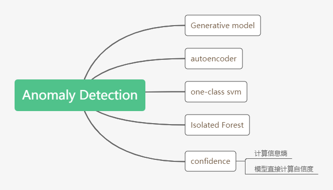

# Anomaly-Detector
异常检测的定义如下:  
* Given a set of training data {x1,x2,...,xN}  
* We want to find a function detecting input x is similar to training data or not  
  
在这里，我们可以简单地将异常检测理解一个二分类问题，即检测器能够根据已有的训练集来区别新的图像是正常的还是异常。对于分类任务而言，异常检测能够帮忙筛选出不包含分类物体的图像进而避免分类器给出错误的类别信息。同时，它也提高了用户的体验感。异常检测与预防恶意攻击又有一定的共同点。通过最大标签概率，我们可以得到一张使得模型对应标签概率最大的图像，但该图像不一定是自然图像。通过异常检测，模型就能够区别出这些图像，同时也抵抗了网络中的恶意攻击。  
NOTE：在分类领域，除了包含分类物体之外的图像都是图像。所以异常图像的数目众多，因此我们根据已收集的异常图像来学习其分布。此外，在某些领域中，异常数据难以收集，数目较少，所以我们也很难直接地使用二分类器来进行异常检测。  
# Category  
根据已有数据是否包含标签，我们可以将异常检测的方法分为以下三类。  
  
对于有标签的数据集我们可以通过引入自信度来决定我们是否相信模型的预测概率分布。一般，我们有以下两种方法来计算概率分布的自信度：  
* 计算概率分布的信息熵。模型对“正常”图像的预测概率分布应呈驼峰式，因此概率分布的信息熵会偏低。反之，则相反。因此，我们可以以概率分布的信息熵来充当概率分布的自信度，但这需要模型对“正常”图像的概率分布为驼峰式，而“异常”图像的概率分布趋于均匀分布。但是这种计算方法存在一定的缺陷，它会将通过最大标签概率得到的图像也辨别为正常图像。  
* 通过模型直接计算出自信度。  
# Method
  
# Experiment
在这里，我使用了autoencoder来进行异常检测。首先，我们使用mnist数据集来训练一个autoencoder。那么，对于未在训练集中出现或者与训练集差异很大的图像，autoencder则很难code重构出原来的图像。则此，两者之间的重构误差必定很大。之后，我将多张cifar10数据集中的图像输入到模型之中进行重构，重构的结果如下所示：  
  
我们可以从上述两幅图中看出重构图像与原始图像之间明显的差异。
